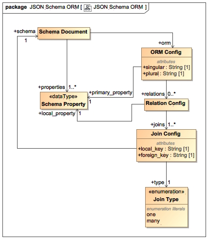
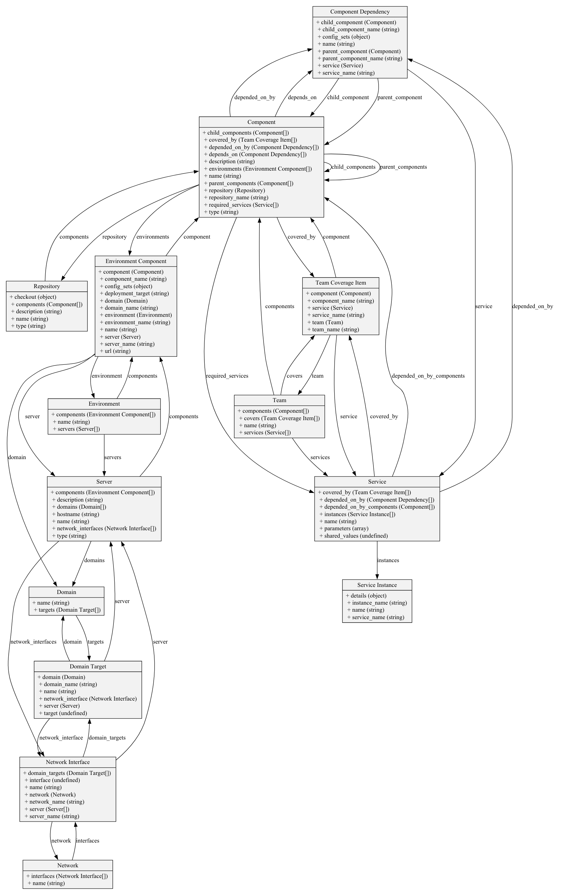

# JSON Schema ORM

A tool for documenting and working with related data

See our `examples/software` for more details...

# Defining Schema



## Example Definition

```
orm:
  singular: Repository
  plural: Repositories
  relations:
    - local_property: components
      joins:
        - schema: component.schema.yaml
          local_key: name
          foreign_key: repository_name
          type: many
type: object
properties:
  name:
    type: string
  type:
    type: string
    enum:
      - git
      - subversion
      - cvs
  checkout:
    type: object
    properties:
      web:
        type: string
        format: uri
      ssh:
        type: string
        format: uri
    required: [ web ]
required: [ name, type, checkout ]
additionalProperties: false
```

## Schema Object

| Name | Description |
|----|---|
| orm | ORM Definition |
| properties | Object Properties |

## ORM Object

| Name | Description |
|------|-------------|
| singular | Singular model name (Repository) |
| plural | Plural collection name (Repositories) |
| primary_property | Primary field name (name) |
| relations | Defined relations |

## ORM Relation Object

| Name | Description |
|------|-------------|
| local_property | Local property to alias the relationship to |
| joins | How to find relations |

## ORM Join Object 

| Name | Description |
|------|-------------|
| schema | Name of the schema file which contains the object |
| local_key | Name of the local property for the relation |
| foreign_key | Name of the foreign property for the relation |
| type | What type of join, one or many |


# Example layout

| Path | Contents |
|------|----------|
| `project` | Contains your project's files |
| `project/schemas` | Contains your project schemas |
| `project/data` | Contains your project's data |
| `project/bundle/schemas.json` | Your bundled schema definitions |

# How to use

1. Create your `project`, `project/data`, `project/schemas` and `project/bundle` directories.
2. Add your schemas and data (refer to `examples/software` for examples)
3. Validate your schemas with `./bin/cli.js -p <path to project> validate schemas` and `./bin/cli.js -p <path to project> validate data`
4. Bundle your schemas with `./bin/cli.js -p <path to project> bundle <path to project>/bundle/schemas.json`
5. Load your schemas and data, for the win!

## Example usage

```
const path = require('path')
const JS_ORM = require('../../../index')
const _ = require('underscore')

const projectSchemasFile = path.resolve(__dirname, '..', 'bundle/schemas.json')
const dataPath = path.resolve(__dirname, '..', 'data')

const orm = JS_ORM.Loader.loadSchemas(projectSchemasFile)

orm.loadData(dataPath)

// simple get
// returns: { name: 'Core API', reposiotry_name: 'Core Project' }
console.log(orm.getRepository('component').get('Core API'))
``` 

# CLI Commands

## Validate

Options: meta-schema, schemas, data

Example: `./bin/cli.js -p examples/software validate schemas`

```shell
$ ./bin/cli.js -p examples/software validate schemas
INFO: Loading examples/software/schemas/component_dependency.schema.yaml...
INFO: Checking examples/software/schemas/component_dependency.schema.yaml...
INFO: Loading examples/software/schemas/component.schema.yaml...
INFO: Checking examples/software/schemas/component.schema.yaml...
INFO: Loading examples/software/schemas/domain_target.schema.yaml...
INFO: Checking examples/software/schemas/domain_target.schema.yaml...
INFO: Loading examples/software/schemas/domain.schema.yaml...
INFO: Checking examples/software/schemas/domain.schema.yaml...
INFO: Loading examples/software/schemas/environment_component.schema.yaml...
INFO: Checking examples/software/schemas/environment_component.schema.yaml...
INFO: Loading examples/software/schemas/environment.schema.yaml...
INFO: Checking examples/software/schemas/environment.schema.yaml...
INFO: Loading examples/software/schemas/network_interface.schema.yaml...
INFO: Checking examples/software/schemas/network_interface.schema.yaml...
INFO: Loading examples/software/schemas/network.schema.yaml...
INFO: Checking examples/software/schemas/network.schema.yaml...
INFO: Loading examples/software/schemas/repository.schema.yaml...
INFO: Checking examples/software/schemas/repository.schema.yaml...
INFO: Loading examples/software/schemas/server.schema.yaml...
INFO: Checking examples/software/schemas/server.schema.yaml...
INFO: Loading examples/software/schemas/service_instance.schema.yaml...
INFO: Checking examples/software/schemas/service_instance.schema.yaml...
INFO: Loading examples/software/schemas/service.schema.yaml...
INFO: Checking examples/software/schemas/service.schema.yaml...
INFO: Loading examples/software/schemas/team_coverage_item.schema.yaml...
INFO: Checking examples/software/schemas/team_coverage_item.schema.yaml...
INFO: Loading examples/software/schemas/team.schema.yaml...
INFO: Checking examples/software/schemas/team.schema.yaml...
OK: All schemas confirmed
```

## Bundle

Example: `./bin/cli.js -p examples/software bundle examples/software/bundle/schemas.json`

```shell
$ ./bin/cli.js -p examples/software bundle examples/software/bundle/schemas.json
OK: Wrote examples/software/bundle/schemas.json...
```

## Diagram

Example: `./bin/cli.js -p examples/software diagram && open test.png`



```shell
$ ./bin/cli.js -p examples/software diagram examples/software/diagrams/model.png
INFO: Wrote dot file to examples/software/diagrams/model.dot...
OK: Wrote png to examples/software/diagrams/model.png...
```

## Repo Readmes

Example: `./examples/software/bin/build-repo-readme.js "Helper Library Repo"`


```shell
$ ./examples/software/bin/build-repo-readme.js "Helper Library Repo"
Compiling all doT templates...
Compiling readme.dot to function
Compiling data model...
OK: Wrote repo readme to examples/software/build/repo-readmes/Helper Library Repo.md...
$ ./examples/software/bin/build-repo-readme.js "Core Project"
Compiling all doT templates...
Compiling readme.dot to function
Compiling data model...
OK: Wrote repo readme to examples/software/build/repo-readmes/Core Project.md...
```

[Helper Library Repo](examples/software/build/repo-readmes/Helper%20Library%20Repo.md)
[Core Project](examples/software/build/repo-readmes/Core%20Project.md)

## Wiki

Example: `./examples/software/bin/build-wiki.js`

[Wiki](examples/software/build/wiki/Components.md)