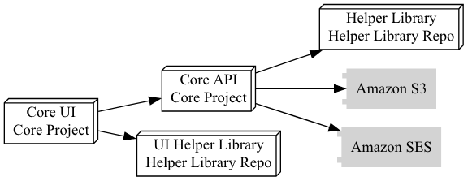

Below you will find a list of applications and libraries.

## Main Components

| Project Name | Depends on |
|--------------|------------|
| [ Core UI ](/examples/software/build/wiki/Components/Core-UI.md) | [Core API (application) ](/examples/software/build/wiki/Components/Core-API.md), [Helper Library (library) ](/examples/software/build/wiki/Components/Helper-Library.md), [UI Helper Library (library) ](/examples/software/build/wiki/Components/UI-Helper-Library.md) |

## Applications

| Application Name | Repository | Source |
|------------------|------------|---------------:|
| [ Core API ](/examples/software/build/wiki/Components/Core-API.md) | [Core Project](/examples/software/build/wiki/Repositories/Core-Project.md) | [Web](http://example.com/site.git) |
| [ Core UI ](/examples/software/build/wiki/Components/Core-UI.md) | [Core Project](/examples/software/build/wiki/Repositories/Core-Project.md) | [Web](http://example.com/site.git) |

## Libraries

| Library Name | Repository | Source |
|------------------|------------|---------------:|
| [ Helper Library ](/examples/software/build/wiki/Components/Helper-Library.md) | [Helper Library Repo](/examples/software/build/wiki/Repositories/Helper-Library-Repo.md) | [Web](http://example.com/lib.git) |
| [ UI Helper Library ](/examples/software/build/wiki/Components/UI-Helper-Library.md) | [Helper Library Repo](/examples/software/build/wiki/Repositories/Helper-Library-Repo.md) | [Web](http://example.com/lib.git) |

---
Generated from [JSON Schema ORM](https://github.com/jmather/json-schema-orm)